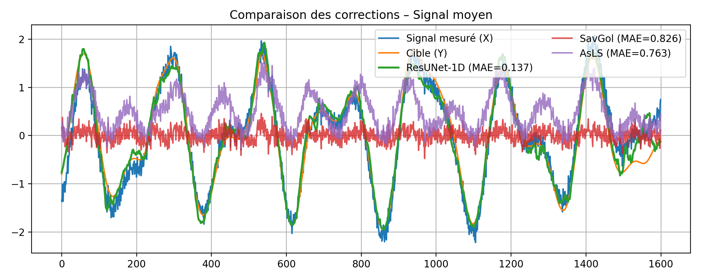
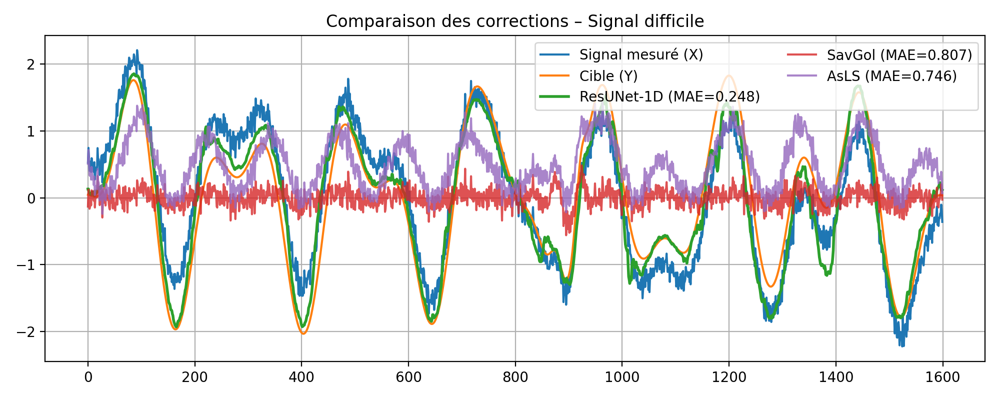

# Suppression de la ligne de base dans des signaux synthétiques à l’aide de ResUNet-1D

Ce projet explore la **correction automatique de ligne de base** dans des signaux 1D.
L’objectif est d’entraîner un modèle **ResUNet-1D** capable de supprimer des lignes de base non linéaires complexes à partir de signaux synthétiques contenant des dynamiques oscillatoires et des dérives basse fréquence.

---

## Aperçu

Les méthodes classiques d’estimation de ligne de base (p. ex., **Savitzky–Golay**, **moindres carrés asymétriques — AsLS**) supposent des tendances simples et lisses (linéaires ou polynomiales).
Cependant, dans des données réalistes de vibration, les lignes de base peuvent être non linéaires, dépendantes du temps, et mélangées avec du bruit additif.

Ce projet construit un **jeu de données synthétique** de signaux de la forme :

$
s(t) = x(t) + b(t) + \varepsilon(t)
$

où :

* $x(t)$ est le “vrai signal” oscillatoire (somme de sinusoïdes + impulsions),
* $b(t)$ est une ligne de base à variation lente (polynôme + sinusoïde basse fréquence),
* $\varepsilon(t)$ est un bruit gaussien additif.

La tâche est de **reconstruire $x(t)$** à partir du signal mesuré $s(t)$.

---

## Méthodologie

### 1. Génération de données synthétiques

* 2 000 signaux de longueur 1 600 échantillons
* Ligne de base = polynôme (ordre 2–3) + sinusoïde basse fréquence
* Bruit gaussien $\mathcal{N}(0, \sigma^2)$
* Normalisation z-score par échantillon

### 2. Modèles évalués

| Catégorie | Méthode          | Description                                  |
| --------- | ---------------- | -------------------------------------------- |
| Classique | Savitzky–Golay   | Lissage local polynomial                     |
| Classique | AsLS (Whittaker) | Ligne de base par moindres carrés pénalisés  |
| Appris    | **ResUNet-1D**   | Encodeur-décodeur 1D avec connexions de saut |

### 3. Détails d’entraînement

* Perte : Huber (Smooth L1)
* Optimiseur : Adam (LR=1e-3, weight decay=1e-4)
* Scheduler : ReduceLROnPlateau
* Early stopping : patience 7
* Framework : PyTorch
* Époques : jusqu’à 50 (meilleur modèle sauvegardé automatiquement)

---

## Résultats

| Méthode                 | RMSE ↓            | MAE ↓             | r ↑       | ΔSNR (dB) ↑ |
| ----------------------- | ----------------- | ----------------- | --------- | ----------- |
| **ResUNet-1D**          | **0.196 ± 0.048** | **0.145 ± 0.035** | **0.980** | **+3.47**   |
| Savitzky–Golay (601, 2) | 0.248 ± 0.041     | 0.186 ± 0.029     | 0.969     | +1.21       |
| AsLS (λ=1e5, p=0.05)    | 0.823 ± 0.021     | 0.661 ± 0.017     | 0.802     | −7.41       |

Le modèle **ResUNet-1D** généralise bien mieux que les approches classiques, apprenant à supprimer des lignes de base non linéaires complexes et à améliorer le rapport signal-bruit de +3,5 dB en moyenne.

---

## Résultats qualitatifs

Ci-dessous, des exemples représentatifs comparant les méthodes de suppression de la ligne de base :

| Cas facile                                   | Cas moyen                                  | Cas difficile                                    |
| -------------------------------------------- | ------------------------------------------ | ------------------------------------------------ |
|  |  |  |

## Arborescence des dossiers

resunet-baseline-app/
│
├── app.py                         # Application Streamlit principale
├── requirements.txt               # Dépendances Python
├── README.md                      # Documentation du projet (avec lien Streamlit)
├── .gitignore                     # Ignorer les fichiers de cache & d’env
├── main                           # Notebook principal
├── results/                       # Comparaisons et exports de métriques
